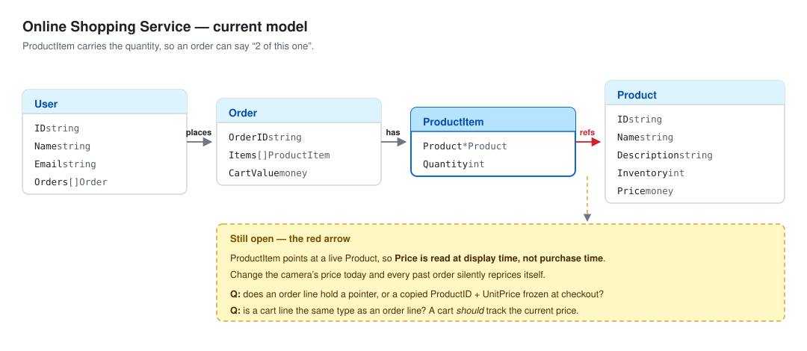

# Online Shopping Service — Design Notes

The current model. Edited in place as decisions change — this always reflects where the
design stands now, not how it got here. No Go in this file; types and relationships only.

---

## Entities

| Entity | Holds | Purpose |
|---|---|---|
| `User` | ID, name, email, their orders | Who is shopping, and their history |
| `Cart` | Line items, keyed by product | The mutable basket before checkout |
| `Order` | Order ID, line items, total | A frozen record of what was bought |
| `ProductItem` | A product, a quantity | One line: *"2 of this one"* |
| `Product` | ID, name, description, stock, price | A thing that can be bought, and how many remain |

## Decisions

- **Cart is its own entity**, separate from `Order`. A cart is mutable and may never become
  an order; an order is a completed record.
- **Cart holds items keyed by product**, so the same product cannot occupy two lines and
  changing a quantity is a direct lookup rather than a scan.
- **Order is frozen at checkout** — once placed, it does not change.
- **Line items, not bare products** — quantity lives on `ProductItem`.
- **Order history hangs off the user** — `User.Orders`.
- **Stock lives on the product** — `Product.Inventory` is the count remaining.
- **The order stores its own total** — `CartValue` is carried, not recomputed.

---

## Open questions

### 1. The freeze is not actually a freeze

`Order` is declared frozen, but `Order.Items` holds `ProductItem`, which points at a live
`*Product`. Price is read through that pointer every time it is displayed. Buy a camera for
£500 in January, drop its price to £400 in March, and the January order reports £400.

Immutability of the *order* does not help when the data it needs lives somewhere mutable.

**Q:** what must the order line copy for the freeze to be real — and once it copies that,
does it still need the pointer?

### 2. One line type or two

The cart and the order both hold `ProductItem`, but they want opposite behaviour:

- A **cart** line *should* track the live price. If the camera drops while it sits in the
  basket, the shopper pays the lower price.
- An **order** line must never move.

**Q:** does one type serve both, or does checkout convert a cart line into a different type?

### 3. `CartValue` is derived

The total is the sum of the lines. Storing it means every mutation must update it. On a
mutable `Cart` that is a real hazard; on a frozen `Order` it is closer to the *point* — a
stored total is one more thing the freeze protects.

**Q:** computed on `Cart`, stored on `Order`?

### 4. Nothing tracks order status

`Pending → Processing → Shipped → Delivered`, plus `Cancelled`.

**Q:** what field, what type, and what stops `Delivered → Pending`? Note this sits awkwardly
with "an order is frozen" — status is the one thing that must still change.

### 5. `User.Orders` makes a cycle

If an order needs to know whose it is, `User → Order → User` is a cycle. It also means
loading one user drags in their entire order history.

**Q:** does the user hold orders, or does the order hold a user ID with the lookup elsewhere?

### 6. Stock on the product is the race

Two users check out the last unit at once. Both read `Inventory == 1`, both decrement,
stock goes to `-1`.

**Q:** what single operation is atomic, and when is stock taken — add-to-cart, checkout, or
payment success? What returns it if payment then fails?

### 7. The type of `money`

`float64` cannot represent `0.1 + 0.2` exactly, so totals drift and equality breaks.

**Q:** what type, and in what unit?

### 8. Payment

Multiple methods are required, and a payment fails in ways the caller must tell apart —
declined, insufficient funds, timeout.

**Q:** what is the interface, its one method, and what does that method return?
