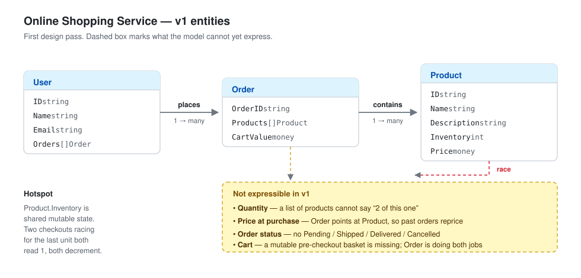

# Online Shopping Service — Design Notes

A running record of the design as it is decided. Written before the code, updated as
thinking changes. No Go in this file — types and relationships only.

---

## v1 — first pass at the entities

The starting model: three entities, described as of the first design pass.

### What each entity is for

| Entity | Holds | Purpose |
|---|---|---|
| `User` | ID, name, email, their orders | Who is shopping, and their history |
| `Order` | Order ID, the products in it, the total | A basket of products at checkout, and what it came to |
| `Product` | ID, name, description, stock left, price | A thing that can be bought, and how many remain |

### Decisions made so far

- **Order history hangs off the user.** `User.Orders` is the list of orders that user placed.
- **The cart is the order's product list.** Rather than a separate `Cart` entity, the collection of products *is* the order.
- **Stock lives on the product.** `Product.Inventory` is the single count of how many remain.
- **The order stores its own total.** `CartValue` is carried on the order rather than recomputed.

---

## Open questions

Not yet decided. Each of these changes the diagram above.

### 1. Quantity is missing

`Order.Products` is a list of products. Where does *"2 of this one"* live? A list can hold
the same product twice, but then a cart of 30 identical items is 30 entries, and changing
the quantity means finding and mutating a list.

**Question:** does the order hold products, or does it hold *lines* — a product plus a count?

### 2. Price at the time of purchase

A product's price is on `Product`. An order points at products. So when the price of a
camera changes tomorrow, every past order that contains it silently reprices — the order
history now reports figures that were never charged.

**Question:** what does an order have to *copy* rather than reference, and what does that
imply about whether `Order` can point at `Product` at all?

### 3. `CartValue` is derived

The total is the sum of the lines. Storing it means every mutation must update it, and
any path that forgets leaves the order lying about its own value.

**Question:** stored or computed? (Note: for an order, unlike a cart, there is a real
argument for storing it — see question 2.)

### 4. Cart and Order are the same thing here

Right now there is no cart — the order *is* the cart. But a cart is mutable, belongs to a
user, has no total until checkout, and may never become an order. An order is immutable,
has been paid for, and has a status.

**Question:** one entity or two?

### 5. Nothing tracks order status

The requirements need `Pending → Processing → Shipped → Delivered`, plus `Cancelled`.
Not in the model yet.

**Question:** what field, what type, and what stops an illegal transition?

### 6. `User.Orders` makes a cycle

If an order ever needs to know whose it is, `User → Order → User` is a reference cycle.
It also means loading one user drags in their entire order history.

**Question:** should the user hold orders, or should the order hold a user ID and a lookup
live elsewhere?

### 7. Stock on the product is the race

Two users check out the last unit at the same instant. Both read `Inventory == 1`, both
decrement, and stock goes to `-1`.

**Question:** what guards `Inventory`, and at what moment is stock actually taken —
add-to-cart, checkout, or payment success?

### 8. The type of `money`

Left deliberately abstract above. `float64` cannot represent `0.1 + 0.2` exactly.

**Question:** what type, and in what unit?

---

## Changelog

| Version | Change |
|---|---|
| v1 | Initial three entities: `User`, `Order`, `Product` |
